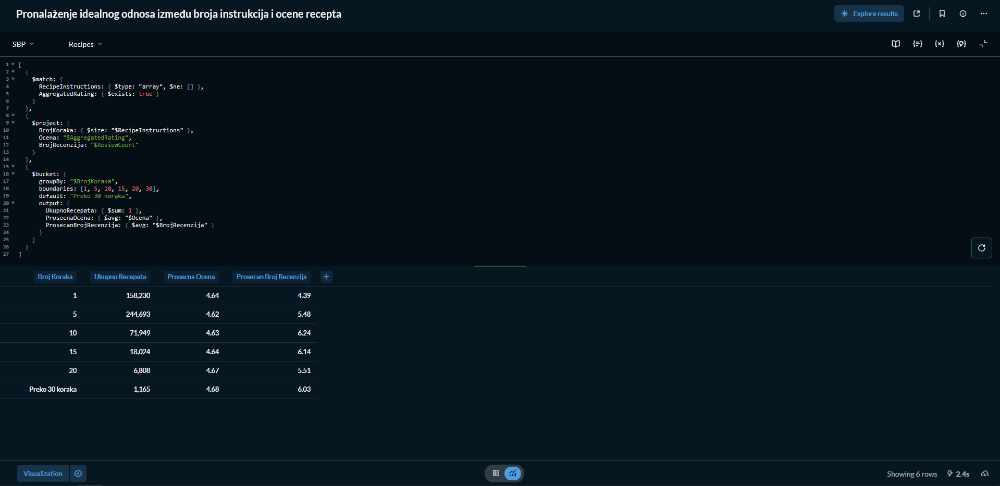
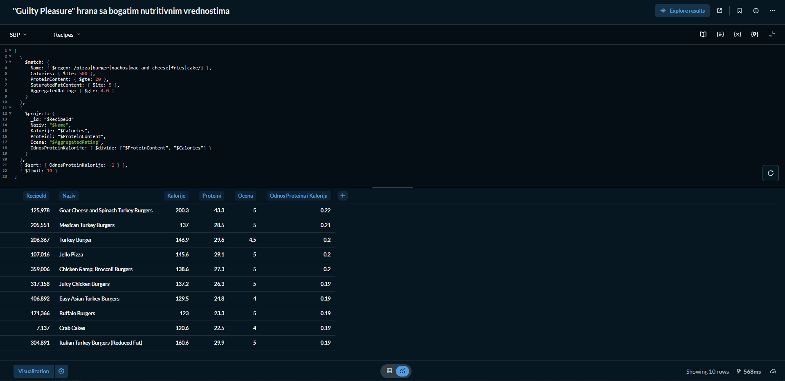
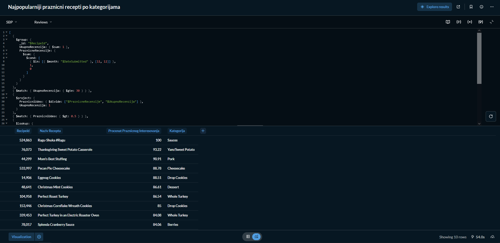
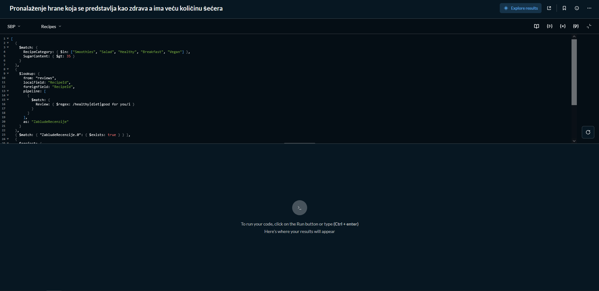

# Upiti

### 1. Pronađi visoko nutritivne recepte (nizak natrijum, visok protein) po svakoj kategoriji.

```javascript
[
  {
    $match: {
      RecipeCategory: { $exists: true, $ne: null },
      ProteinContent: { $gte: 25 }, 
      SodiumContent: { $lte: 400 }, 
      AggregatedRating: { $gte: 4.5 }
    }
  },
  {
    $sort: { 
      RecipeCategory: 1, 
      AggregatedRating: -1, 
      ProteinContent: -1 
    }
  },
  {
    $group: {
      _id: "$RecipeCategory",
      NajboljiRecept: { $first: "$$ROOT" }
    }
  },
  {
    $project: {
      _id: 0,
      Kategorija: "$_id",
      Naziv: "$NajboljiRecept.Name",
      Proteini: "$NajboljiRecept.ProteinContent",
      Natrijum: "$NajboljiRecept.SodiumContent",
      Ocena: "$NajboljiRecept.AggregatedRating"
    }
  },
  { $sort: { Proteini: -1 } }
]
```

Rezultat upita: <br>


### 2. Pronađi odnos između broja instrukcija recepta i njegove ocene.

```javascript
[
  {
    $match: {
      RecipeInstructions: { $type: "array", $ne: [] },
      AggregatedRating: { $exists: true }
    }
  },
  {
    $project: {
      BrojKoraka: { $size: "$RecipeInstructions" },
      Ocena: "$AggregatedRating",
      BrojRecenzija: "$ReviewCount"
    }
  },
  {
    $bucket: {
      groupBy: "$BrojKoraka",
      boundaries: [1, 5, 10, 15, 20, 30],
      default: "Preko 30 koraka",
      output: {
        UkupnoRecepata: { $sum: 1 },
        ProsecnaOcena: { $avg: "$Ocena" },
        ProsecanBrojRecenzija: { $avg: "$BrojRecenzija" }
      }
    }
  }
]
```

Rezultat upita: <br>



# 3. Pronalaženje "Guilty Pleasure" hrane sa bogatim nutritivnim vrednostima.

```javascript
[
  {
    $match: {
      Name: { $regex: /pizza|burger|nachos|mac and cheese|fries|cake/i },
      Calories: { $lte: 500 },
      ProteinContent: { $gte: 20 },
      SaturatedFatContent: { $lte: 5 },
      AggregatedRating: { $gte: 4.0 }
    }
  },
  {
    $project: {
      _id: "$RecipeId"
      Naziv: "$Name",
      Kalorije: "$Calories",
      Proteini: "$ProteinContent",
      Ocena: "$AggregatedRating",
      OdnosProteinKalorije: { $divide: ["$ProteinContent", "$Calories"] }
    }
  },
  { $sort: { OdnosProteinKalorije: -1 } },
  { $limit: 10 }
]
```

Rezultati upita: <br>



# 4. Pronalaženje najpopularnijih prazničnih recepata po kategorijama.

```javascript
[
  {
    $group: {
      _id: "$RecipeId",
      UkupnoRecenzija: { $sum: 1 },
      PraznicneRecenzije: {
        $sum: { 
          $cond: [
            { $in: [{ $month: "$DateSubmitted" }, [11, 12]] }, 
            1, 
            0
          ] 
        } 
      }
    }
  },
  { $match: { UkupnoRecenzija: { $gte: 30 } } },
  {
    $project: {
      PraznicniUdeo: { $divide: ["$PraznicneRecenzije", "$UkupnoRecenzija"] },
      UkupnoRecenzija: 1
    }
  },
  { $match: { PraznicniUdeo: { $gt: 0.5 } } },
  {
    $lookup: {
      from: "recipes",
      localField: "_id",
      foreignField: "RecipeId",
      as: "Recept"
    }
  },
  { $unwind: "$Recept" },
  {
    $project: {
      NazivRecepta: "$Recept.Name",
      ProcenatPraznicnogInteresovanja: { $multiply: ["$PraznicniUdeo", 100] },
      Kategorija: "$Recept.RecipeCategory"
    }
  },
  { $sort: { ProcenatPraznicnogInteresovanja: -1 } },
  { $limit: 10 }
]
```

Rezultati upita: <br>



# 5. Pronalaženje hrane koja se predstavlja kao zdrava a ima veću količinu šećera.

```javascript
[
  { 
    $match: { 
      RecipeCategory: { $in: ["Smoothies", "Salad", "Healthy", "Breakfast", "Vegan"] },
      SugarContent: { $gt: 35 }
    } 
  },
  {
    $lookup: {
      from: "reviews",
      localField: "RecipeId",
      foreignField: "RecipeId",
      pipeline: [
        { 
          $match: { 
            Review: { $regex: /healthy|diet|good for you/i }
          } 
        }
      ],
      as: "ZabludeRecenzije"
    }
  },
  { $match: { "ZabludeRecenzije.0": { $exists: true } } },
  {
    $project: {
      _id: "$RecipeId",
      Naziv: "$Name",
      Kategorija: "$RecipeCategory",
      SecerGrami: "$SugarContent",
      PrimerZablude: { $arrayElemAt: ["$ZabludeRecenzije.Review", 0] }
    }
  },
  { $sort: { SecerGrami: -1 } },
  { $limit: 10 }
]
```

Rezultati upita (dogodio se timeout): <br>

